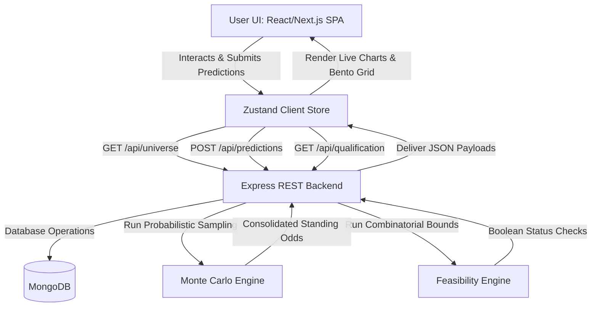

# 🏏 IPL Playoff Predictor & Scenario Simulator

[](https://nodejs.org/)
[](https://www.typescriptlang.org/)
[](https://nextjs.org/)
[](https://react.dev/)
[](https://tailwindcss.com/)
[](https://expressjs.com/)
[](https://www.mongodb.com/)
[](LICENSE)

---

## 📖 What is the IPL Playoff Predictor?

The **IPL Playoff Predictor & Scenario Simulator** is a full-stack, data-driven sports analytics platform that serves as an interactive playground for IPL fans, analysts, and math enthusiasts. 

During the later stages of the IPL league phase, the race for the Top 4 playoff spots becomes incredibly tight and complex. A single match's run-rate margin can swing a team's qualification chances dramatically. This application models the **IPL league stage** (specifically using a **Match-50 cutoff**) and lets users predict the outcomes of the remaining 20 matches (Matches 51–70).

It combines **probabilistic forecasting** (Monte Carlo simulations) with **deterministic boundary analysis** (exact mathematical elimination checking) to give users an authoritative view of each team's exact standing, projected path, and qualification odds in real time.

---

## ⚙️ How Does It Work?

The platform splits the tournament structure into two distinct phases to establish a robust simulation baseline:

```
┌─────────────────────────────────────────┐      ┌─────────────────────────────────────────┐
│         MATCHES 1 – 50 (Baseline)       │      │       MATCHES 51 – 70 (Simulator)       │
├─────────────────────────────────────────┤      ├─────────────────────────────────────────┤
│ • Historical completed matches          │ ───> │ • Upcoming fixtures                     │
│ • Rebuilt points & NRR standings        │      │ • User overrides (saved predictions)    │
│ • Special cases: No Results, Super Overs│      │ • Probabilistic Monte Carlo modeling    │
└─────────────────────────────────────────┘      └─────────────────────────────────────────┘
```

1. **Reconstructing the Baseline (Matches 1–50):**
   * The backend dynamically reads and parses completed matches (1–50).
   * It calculates the official baseline points and Net Run Rates (NRR) for all 10 teams.
   * **Special Cases:** 
     * *No Result (NR):* Automatically splits points (+1 to each team) and handles NRR safely without crashing.
     * *Super Overs:* Awards the win points and W/L standings record, but excludes the regulation NRR formula to prevent artificial statistical distortion.

2. **The Predictive Sandbox (Matches 51–70):**
   * Matches 51 to 70 represent the final 20 matches of the group stage.
   * **Leakage-Resistant Boundary:** The application strictly isolates future matches. Any upcoming match has all result fields stripped out on load, ensuring no speculative future data leaks into the active simulation bounds.
   * **User Overrides:** Whenever you make a prediction, it acts as a "locked" result in the database. The simulation respects your choices as ground-truth facts and simulates only the remaining *unpredicted* games.

3. **Dual-Core Calculation Engines:**
   * **Monte Carlo Simulator (1,000+ Iterations):** Unpredicted matches are simulated thousands of times using historical win-weights and realistic run/wicket margin distributions to produce a probabilistic percentage chance of qualifying.
   * **Mathematical Feasibility Engine (Combinatorial Enumeration):** Explores all remaining permutations of results under a points-only tie-breaker rule (assuming the target team wins any NRR tie). It determines with absolute mathematical certainty whether a team is still alive or completely eliminated from top-4 contention.

---

## 🕹️ How Can I Use It? (User Guide)

The web interface is split into highly responsive, interactive dashboards that let you build and analyze scenarios step by step:

### Step 1: Analyze the Standings (Dashboard)
* **What you see:** The live, real-time points table of the current season.
* **Movement Indicators:** Colored arrows show how teams have moved up or down compared to the baseline after applying your custom predictions.
* **Net Run Rate Race:** Inspect each team's Net Run Rate to see who holds the tie-breaker advantage.

### Step 2: Simulate Matches (Simulator Panel)
* **Browse Upcoming Matches:** View the schedule of matches 51 through 70.
* **Make Predictions:** Click on any upcoming match card to enter your prediction:
  * Select the **Predicted Winner**.
  * Choose the **Margin Type** (e.g., *Defended Runs* or *Chasing Overs/Balls Remaining*).
  * Enter the specific margin details (e.g., won by 15 runs, or chased the target in 18.2 overs).
* **Save and Recompute:** Click **Save Prediction**. The platform instantly updates the global database, and all standings, movement trends, and qualification charts are automatically recalculated on the server.
* **Clear Scenarios:** Click **Reset All** to wipe your custom scenario and return to the original baseline.

### Step 3: Inspect Qualification Odds (Qualification Panel)
* **Monte Carlo Percentages:** View beautiful dynamic bar charts showing the percentage probability of each team finishing in the Top 2 or qualifying for the Top 4.
* **Team-Specific Breakdown:** Click on any team to view their mathematical feasibility status. Even if a team has a `0%` Monte Carlo chance, the math engine will tell you if they are *mathematically* still in the hunt (i.e., there is at least one extreme combination of results where they qualify).

---

## 📌 Table of Contents

- [🏏 IPL Playoff Predictor \& Scenario Simulator](#-ipl-playoff-predictor--scenario-simulator)
  - [📖 What is the IPL Playoff Predictor?](#-what-is-the-ipl-playoff-predictor)
  - [⚙️ How Does It Work?](#️-how-does-it-work)
  - [🕹️ How Can I Use It? (User Guide)](#️-how-can-i-use-it-user-guide)
    - [Step 1: Analyze the Standings (Dashboard)](#step-1-analyze-the-standings-dashboard)
    - [Step 2: Simulate Matches (Simulator Panel)](#step-2-simulate-matches-simulator-panel)
    - [Step 3: Inspect Qualification Odds (Qualification Panel)](#step-3-inspect-qualification-odds-qualification-panel)
  - [🌟 Key Features](#-key-features)
  - [📊 System Architecture \& Data Flow](#-system-architecture--data-flow)
  - [💻 Tech Stack](#-tech-stack)
    - [Frontend](#frontend)
    - [Backend](#backend)
  - [📂 Directory Structure](#-directory-structure)
  - [⚙️ Getting Started \& Local Installation](#️-getting-started--local-installation)
    - [Prerequisites](#prerequisites)
    - [Step-by-Step Setup](#step-by-step-setup)
      - [1. Clone the Repository](#1-clone-the-repository)
      - [2. Configure Environment Variables](#2-configure-environment-variables)
      - [3. Backend Setup \& Database Seeding](#3-backend-setup--database-seeding)
      - [4. Frontend Setup](#4-frontend-setup)
  - [🔌 API Documentation](#-api-documentation)
    - [Core Endpoints](#core-endpoints)
    - [Scenario Save Payload (`POST /api/predictions`)](#scenario-save-payload-post-apipredictions)
  - [🧠 Algorithmic Deep Dive](#-algorithmic-deep-dive)
    - [Monte Carlo Probabilistic Simulator](#monte-carlo-probabilistic-simulator)
    - [Mathematical Feasibility Engine](#mathematical-feasibility-engine)
  - [🛡️ Validation \& Reliability Guarantees](#️-validation--reliability-guarantees)
  - [🚀 Future Roadmap](#-future-roadmap)
  - [🤝 Contributing](#-contributing)
  - [📝 License](#-license)
  - [✍️ Author](#️-author)

---

## 🌟 Key Features

* **Match-50 Derived Universe:** Standings are accurately initialized using the historical results of completed league matches (Matches 1–50).
* **Interactive Scenario Builder:** Empowers users to override the remaining matches (Matches 51–70) with custom match predictions including winners, margin types, runs, and wicket details.
* **Server-Authoritative Computations:** Ensures perfect simulation parity and zero client-side calculation overhead by running Monte Carlo algorithms directly on the Node.js/TypeScript backend.
* **Leakage-Resistant Architecture:** Features rigid verification rules that filter out pre-determined future match results from upcoming simulation windows to guarantee unbiased predictive outputs.
* **Nuanced Special-Case Handling:** Correctly handles edge-case matches:
  * **No Result (NR):** Distributes points evenly (+1 point to each team) and handles NRR safely.
  * **Super Overs:** Awards victory points and updates Win/Loss statistics while strictly skipping NRR updates for the tied regulation innings.
* **Comprehensive Metrics:** Dynamic tracking showing Real vs. Projected Standings, visual standings movement, and real-time updates of Net Run Rate.

---

## 📊 System Architecture & Data Flow



---

## 💻 Tech Stack

### Frontend
* **Framework:** Next.js 15.1.3 (utilizing the flexible App Router model)
* **Libraries:** React 19.2.4, Zustand 5.0.13 (Global client state)
* **Styling:** Tailwind CSS (Modern, high-performance v4 architecture)
* **Visuals & Charts:** Recharts, Lucide-React, and Framer Motion for elegant transition animations
* **HTTP Client:** Axios (interfacing with backend API endpoints)

### Backend
* **Runtime & Language:** Node.js, TypeScript
* **Server Framework:** Express 4.21.2
* **ORM & Database:** Mongoose 8.9.3, MongoDB Atlas
* **Scaffolding/Runner:** `tsx` (TypeScript Execute) for hot-reloading development servers

---

## 📂 Directory Structure

```text
├── backend/
│   ├── src/
│   │   ├── controllers/      # Route controllers (universe, matches, predictions, qualification)
│   │   ├── models/           # Mongoose Schemas (Team, Match, Prediction)
│   │   ├── routes/           # Express router endpoints
│   │   ├── services/
│   │   │   ├── cricketData/  # Data provider syncing (Static JSON Dataset or Sportmonks API)
│   │   │   ├── simulation/   # Core Monte Carlo simulation & probabilistic models
│   │   │   └── standings/    # Real/projected standings and NRR calculations
│   │   ├── utils/            # Helper utilities (NRR calculations, math models)
│   │   ├── index.ts          # Main Express entry point
│   │   └── server.ts         # Development dev server bootstrapping
│   ├── tsconfig.json
│   └── package.json
│
├── frontend/
│   ├── src/
│   │   ├── app/              # Next.js App Router (Layouts, pages, global styles)
│   │   ├── components/       # Reusable components (Bento grid panels, standings, prediction cards)
│   │   ├── services/         # Axios client wrappers connecting to backend API
│   │   ├── store/            # Zustand global state (tracks local predictions, theme, API states)
│   │   └── utils/            # Common formatting and color-coordinating utility scripts
│   ├── tsconfig.json
│   └── package.json
│
├── README.md                 # Project documentation
└── .env.example              # Sample environment configurations
```

---

## ⚙️ Getting Started & Local Installation

### Prerequisites
* **Node.js:** version `v20.x` or higher
* **npm:** version `v10.x` or higher
* **MongoDB:** An active local MongoDB instance (`mongodb://127.0.0.1:27017`) or a MongoDB Atlas connection string.

---

### Step-by-Step Setup

#### 1. Clone the Repository
```bash
git clone https://github.com/pranjalgupta1130/IPL-Playoff-Predictor.git
cd IPL-Playoff-Predictor
```

#### 2. Configure Environment Variables
Create a `.env` file in the `backend/` directory based on the `.env.example` template:

```env
# backend/.env
PORT=5000
MONGODB_URI=mongodb://127.0.0.1:27017/ipl-predictor
CORS_ORIGIN=http://localhost:3000

# Cricket Data Configuration (Options: static | sportmonks)
CRICKET_DATA_PROVIDER=static

# (Optional) Required if SPORTMONKS is selected as provider
SPORTMONKS_API_KEY=your_sportmonks_api_key_here
SPORTMONKS_BASE_URL=https://cricket.sportmonks.com/api/v2.0
SPORTMONKS_IPL_LEAGUE_ID=123
SPORTMONKS_SEASON_ID=456
```

Configure your frontend API endpoint if hosting on a custom domain:
```env
# frontend/.env
NEXT_PUBLIC_API_URL=http://localhost:5000/api
```

#### 3. Backend Setup & Database Seeding
Navigate to the backend, install the dependencies, seed your database with the historical fixtures, and run the server:

```bash
cd backend
npm install

# Seed the database (Clears old collections and imports Matches 1-70)
npm run seed

# Spin up the development server
npm run dev
```
The backend server will launch at `http://localhost:5000`.

#### 4. Frontend Setup
Open a separate terminal window, navigate to the frontend directory, install dependencies, and start the Next.js client:

```bash
cd frontend
npm install

# Start the Next.js local development server
npm run dev
```
Your Next.js client will start at `http://localhost:3000`.

---

## 🔌 API Documentation

All backend endpoints are prefixed with `/api`.

### Core Endpoints

| Method | Endpoint | Description | Request Body |
| :--- | :--- | :--- | :--- |
| **GET** | `/api/health` | Service health check | None |
| **GET** | `/api/teams/standings` | Returns baseline + projected standings | None |
| **GET** | `/api/matches/upcoming` | Returns uncompleted league fixtures (Matches 51–70) | None |
| **GET** | `/api/predictions` | Fetches currently saved user-submitted overrides | None |
| **POST** | `/api/predictions` | Upserts/creates a match prediction override | See Payload Below |
| **DELETE** | `/api/predictions/:matchId` | Deletes a prediction for a specific match | None |
| **DELETE** | `/api/predictions/reset/all` | Removes all predictions to clear the simulator | None |
| **GET** | `/api/universe` | Retreives Match-50 bounds and active simulation cutoff metadata | None |
| **GET** | `/api/qualification` | Runs the full Monte Carlo simulator & returns team probabilities | None |
| **GET** | `/api/qualification/team/:name` | Runs targeted Monte Carlo + mathematical logic for a single team | None |

---

### Scenario Save Payload (`POST /api/predictions`)
To lock down custom predictions for upcoming matches, submit a POST request with the following structure:

```json
{
  "matchId": "65abcdf89d023c001f3e721a",
  "predictedWinner": "Mumbai Indians",
  "margin": 15,
  "marginType": "defended_runs",
  "chaseRuns": 175
}
```

**Validation Guidelines:**
* `marginType` must map to: `defended_runs`, `chase_overs`, `balls_remaining`, `runs`, or `wickets`.
* `matchId` must represent a valid, uncompleted match within the Match 51–70 window.
* `predictedWinner` must match one of the participating teams for that match.

---

## 🧠 Algorithmic Deep Dive

### Monte Carlo Probabilistic Simulator
The backend implements a highly scalable Monte Carlo engine:
1. It reads completed baseline statistics (Wins, Losses, Run-Rate deltas) up to Match 50.
2. It fetches upcoming Matches 51–70, replacing matches with user-configured predictions with locked-down outcomes.
3. For remaining unpredicted matches, the engine simulates outcomes dynamically using a weight-balanced team performance probability matrix.
4. It sample-assigns victory margins based on realistic historic probability densities (e.g., chasing within 19 overs, defending by 10-30 runs).
5. The simulation repeats **1,000 times**. Points tables are constructed, sorted (Points descending ➡️ NRR descending), and top-4 teams earn playoff hits.
6. The engine aggregates final ratios into clean probabilities, reflecting how user choices directly influence the playoff picture.

### Mathematical Feasibility Engine
Unlike the probabilistic model, the mathematical feasibility engine uses deterministic permutation parsing to calculate absolute survival or elimination:
* **Worst-Case & Best-Case Points Boundaries:** Computes the mathematical maximum points a target team can achieve, comparing them against the lowest possible points thresholds of surrounding competitors.
* **Combinatorial Enumeration:** When the remaining fixtures permit, the backend evaluates all outcome scenarios to confirm if there is *at least one combination* where the team places in the top 4 on points.
* **Conservative Tie-Breaks:** In points ties on the qualifying boundary (4th place), the engine assumes the team *always* wins the NRR tie-breaker, ensuring a team is never declared "eliminated" until they are mathematically locked out on points.

---

## 🛡️ Validation & Reliability Guarantees

* **Anti-Result Tampering:** The upcoming matches fetched from `/api/universe` are strictly stripped of result-oriented properties. This guarantees the simulation environment is completely insulated from pre-determined database outcomes.
* **Prediction Integrity Checks:** The simulation server validates every prediction object to make sure no invalid scores, phantom teams, or out-of-range matches are injected into the calculations.
* **NRR Rebuilding Sufficiency:** In case of missing telemetry (e.g., empty run counts on historical games), the engine runs a verification check that logs warnings and safely processes matches with standard fallbacks rather than crashing.

---

## 🚀 Future Roadmap

* **Live WebSocket Telemetry:** Enable real-time prediction overlays and active table-rebuilding streams while watching actual matches.
* **Scenario Sharing URLs:** Generate shareable hash-based URLs (e.g., `/sharable/scenario/xyz`) allowing users to easily share their playoff scenarios on social media.
* **Historical Seasons Toggle:** Load and run prediction universes on older legendary IPL seasons (e.g., IPL 2019, 2023).
* **Multi-Criteria Monte Carlo Adjustments:** Let users dynamically adjust the weight of simulated wins (e.g., base probability on current season form, head-to-head records, or squad strengths).

---

## 🤝 Contributing

Contributions are welcome! Please follow these simple guidelines:
1. **Fork** the repository.
2. Create a clean feature branch: `git checkout -b feature/awesome-feature`
3. Commit your changes: `git commit -m 'Add support for custom Monte Carlo seed settings'`
4. Push to the branch: `git push origin feature/awesome-feature`
5. Submit a **Pull Request** explaining your implementation details.

---

## 📝 License

This project is open-source software licensed under the [MIT License](LICENSE).

---

## ✍️ Author

**Pranjal Gupta**
* GitHub: [@pranjalgupta1130](https://github.com/pranjalgupta1130)
* Email: `pranjalg1130@gmail.com`

---
*Created and maintained with ❤️ for the cricket analytics community.*
